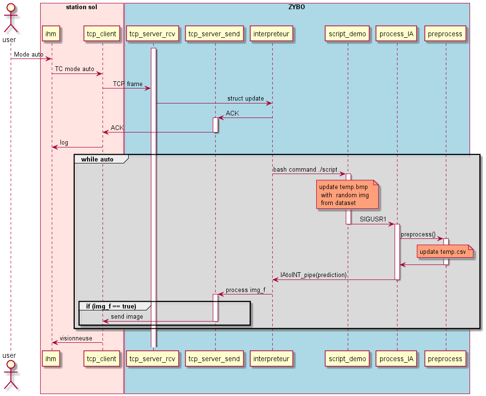

# A-Eye_Documentation
Documentation du projet A-Eye  
Ce projet permet notamment de collaborer sur les diagrammes UML  
Le reste de la documentation (Design, Architecture, ...) est sur le Riesling.  

## A-Eye_Visor
  
